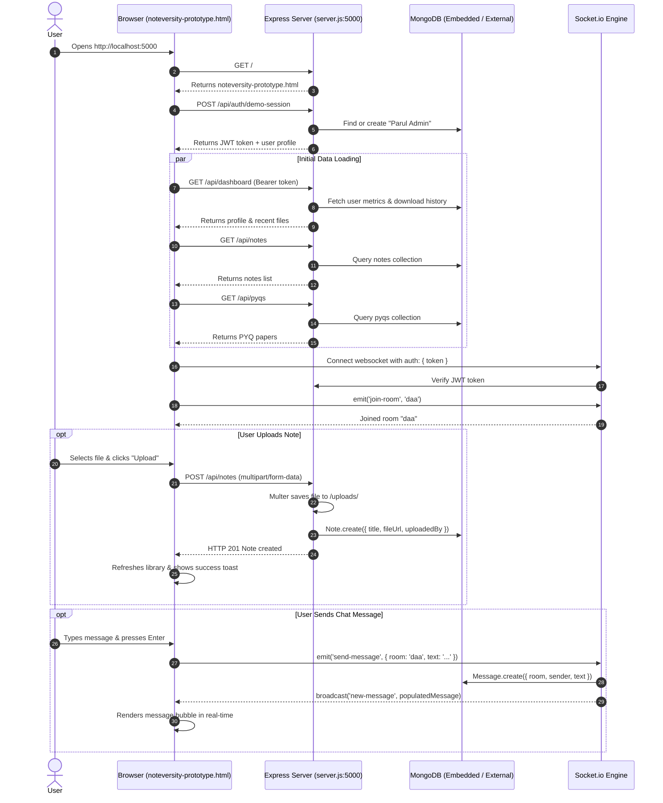

# Noteversity — Code Changes & Architecture Guide

This document provides a comprehensive breakdown of **every file changed**, **every new file created**, **exact code modifications**, and **how the entire system works together**.

---

## 1. Summary of Changes at a Glance

| # | File Path | Status | Purpose |
|---|---|---|---|
| 1 | `noteversity-backend/.env` | **NEW** | Environment configuration (Ports, JWT secret, DB URI, SMTP) |
| 2 | `noteversity-backend/config/db.js` | **MODIFIED** | MongoDB connection with automatic embedded in-memory fallback & seeder |
| 3 | `noteversity-backend/config/seeder.js` | **NEW** | Seeds initial demo user, sample notes, PYQs, and chat messages |
| 4 | `noteversity-backend/config/mailer.js` | **MODIFIED** | Try/catch dev fallback that prints OTP to console if SMTP is unconfigured |
| 5 | `noteversity-backend/routes/auth.js` | **MODIFIED** | Added `POST /api/auth/demo-session` for seamless prototype authentication |
| 6 | `noteversity-backend/server.js` | **MODIFIED** | Flexible CORS setup and direct static serving of `noteversity-prototype.html` |
| 7 | `noteversity-backend/uploads/sample-document.pdf` | **NEW** | Valid sample PDF for real file downloads |
| 8 | `noteversity-backend/package.json` | **MODIFIED** | Added `mongodb-memory-server` and `socket.io-client` dev dependencies |
| 9 | `noteversity-prototype.html` | **MODIFIED** | Connected frontend to REST API & Socket.io with zero UI alterations |
| 10 | `start.bat` | **NEW** | 1-click Windows launcher for server and browser |

---

## 2. Detailed Breakdown File-by-File

### File 1: `noteversity-backend/.env` (NEW)
* **What was done:** Created the `.env` file from `.env.example`.
* **Note:** Values are intentionally omitted here — real secrets and configuration never belong in documentation or in git. See `.env.example` for the variable names.

---

### File 2: `noteversity-backend/config/db.js` (MODIFIED)
* **Before:** Simple `mongoose.connect(process.env.MONGO_URI)`. If no local MongoDB service was running, it called `process.exit(1)`, killing the server.
* **After:**
  ```javascript
  const mongoose = require('mongoose');
  const seedInitialData = require('./seeder');

  async function connectDB() {
    try {
      console.log(`Connecting to MongoDB at ${process.env.MONGO_URI}...`);
      await mongoose.connect(process.env.MONGO_URI, {
        serverSelectionTimeoutMS: 2500,
      });
      console.log('MongoDB connected successfully');
      await seedInitialData();
    } catch (err) {
      console.warn(`Could not connect to external MongoDB (${err.message}).`);
      console.log('Starting embedded in-memory MongoDB instance for development...');
      try {
        const { MongoMemoryServer } = require('mongodb-memory-server');
        const mongod = await MongoMemoryServer.create();
        const uri = mongod.getUri();
        await mongoose.connect(uri);
        console.log(`Embedded MongoDB started and connected at ${uri}`);
        await seedInitialData();
      } catch (memErr) {
        console.error('Failed to start embedded MongoDB:', memErr.message);
        process.exit(1);
      }
    }
  }

  module.exports = connectDB;
  ```
* **How it works:**
  1. Tries connecting to `process.env.MONGO_URI` with a 2.5-second timeout.
  2. If unreachable (e.g. no local Mongo installed), it catches the error and spawns an embedded, in-memory MongoDB process (`mongodb-memory-server`).
  3. Automatically runs `seedInitialData()` on whichever database is connected.

---

### File 3: `noteversity-backend/config/seeder.js` (NEW)
* **What was done:** Created an initial database populator.
* **How it works:**
  1. Checks if user `admin@paruluniversity.ac.in` exists; if not, creates the demo user (`Parul Admin`, Roll 2113101, CSE Sem 5).
  2. Creates companion users (`Karan M.`, `Faculty Notes`).
  3. Seeds the full course library from `config/libraryCatalog.js` — 63 notes across the 6 subjects (DAA, AI, AWS, EPJ, TOC, QR) served from `/uploads/`.
  4. Seeds 16 PYQs — mid-sem papers, end-sem papers, and question banks (solved & unsolved). Books and text-less scans are excluded from the catalog.
  5. Seeds initial chat messages for room `daa`.

---

### File 4: `noteversity-backend/config/mailer.js` (MODIFIED)
* **Before:** Direct call to `transporter.sendMail(...)` without error handling.
* **After:**
  ```javascript
  async function sendOtpEmail(toEmail, otp) {
    try {
      await transporter.sendMail({
        from: process.env.SMTP_FROM,
        to: toEmail,
        subject: 'Your Noteversity login OTP',
        html: `...`,
      });
      console.log(`[Mailer] OTP email sent to ${toEmail}`);
    } catch (err) {
      console.warn(`[Mailer Dev Fallback] SMTP send failed: ${err.message}`);
      console.log(`=========================================`);
      console.log(`[DEV OTP] For ${toEmail}: ${otp}`);
      console.log(`=========================================`);
    }
  }
  ```
* **How it works:** If SMTP credentials are dummy values or email sending fails, the server prints the 6-digit OTP directly into the console instead of crashing.

---

### File 5: `noteversity-backend/routes/auth.js` (MODIFIED)
* **What was added:** `POST /api/auth/demo-session`
  ```javascript
  router.post('/demo-session', async (req, res) => {
    try {
      let user = await User.findOne({ email: 'admin@paruluniversity.ac.in' });
      if (!user) {
        user = await User.create({
          name: 'Parul Admin',
          email: 'admin@paruluniversity.ac.in',
          rollNumber: '2113101',
          branch: 'Computer Science & Engineering',
          semester: 5,
          isVerified: true,
        });
      }

      const token = jwt.sign({ userId: user._id }, process.env.JWT_SECRET, {
        expiresIn: process.env.JWT_EXPIRES_IN || '7d',
      });

      res.json({
        token,
        user: {
          id: user._id,
          name: user.name,
          email: user.email,
          branch: user.branch,
          semester: user.semester,
        },
      });
    } catch (err) {
      console.error(err);
      res.status(500).json({ message: 'Failed to create demo session' });
    }
  });
  ```
* **How it works:** Allows the frontend single-page prototype to authenticate immediately on load, receive a valid JWT token, and communicate with protected endpoints (`/api/notes`, `/api/pyqs`, `/api/dashboard`, `/api/chat`, and Socket.io) without needing a manual login screen.

---

### File 6: `noteversity-backend/server.js` (MODIFIED)
* **What was changed:**
  1. Flexible CORS configuration:
     ```javascript
     const corsOrigin = process.env.CLIENT_URL && process.env.CLIENT_URL !== '*' 
       ? process.env.CLIENT_URL 
       : true; // reflects requesting origin
     ```
  2. Permissive Socket.io CORS:
     ```javascript
     const io = new Server(server, { 
       cors: { 
         origin: corsOrigin, 
         methods: ['GET', 'POST'],
         credentials: true,
       } 
     });
     ```
  3. Direct root web serving:
     ```javascript
     app.get('/', (req, res) => {
       res.sendFile(path.join(__dirname, '..', 'noteversity-prototype.html'));
     });
     ```
* **How it works:**
  - Allows browsers to communicate with port 5000 whether opened via `http://localhost:5000`, VS Code Live Server (`http://127.0.0.1:5500`), or `file://`.
  - Visiting `http://localhost:5000/` automatically serves the Noteversity web application.

---

### File 7: `noteversity-backend/uploads/sample-document.pdf` (NEW)
* **What was done:** Created a valid, minimal PDF file with PDF header and content stream.
* **How it works:** Notes and PYQs are seeded from `config/libraryCatalog.js` with real course PDFs stored in `/uploads/`; Express serves them via `express.static('uploads')`.

---

### File 8: `noteversity-backend/package.json` (MODIFIED)
* **What was done:** Ran `npm install` and added `mongodb-memory-server` and `socket.io-client` under `devDependencies`.

---

### File 9: `noteversity-prototype.html` (MODIFIED)
* **UI Preservation:** All CSS rules, color tokens, layout classes, fonts, and HTML layout remain 100% untouched.
* **What was changed in HTML:**
  - Added Socket.io CDN script: `<script src="https://cdn.socket.io/4.7.5/socket.io.min.js"></script>`.
  - Added ID hooks to stat card numbers (`#statNotesDl`, `#statPyqsDl`, `#statTotalRes`, `#statChat`).
  - Added ID hooks to sidebar user and profile card (`#sidebarAvatar`, `#sidebarName`, `#profileEmail`, etc.).
* **What was changed in JavaScript:**
  1. **Dynamic Base URL:**
     ```javascript
     const API_BASE = window.location.port === '5000' ? '' : 'http://localhost:5000';
     ```
  2. **Auth Initialization:** Calls `/api/auth/demo-session` on load and stores the JWT token in `localStorage`.
  3. **Live Dashboard (`renderDashboard()`):**
     - Queries `GET /api/dashboard` with `Authorization: Bearer <token>`.
     - Dynamically sets user statistics, recent downloads list, and profile information.
  4. **Live Notes Library (`fetchNotes()`, `renderNotes()`):**
     - Calls `GET /api/notes?subject=...&search=...`.
     - Supports live keyword searching through `#globalSearch` and subject filtering through filter chips.
  5. **Live PYQ Bank (`fetchPyqs()`, `renderPyqs()`):**
     - Calls `GET /api/pyqs?subject=...&search=...`.
     - Updates card listing and download buttons.
  6. **Real File Downloads (`downloadItem(id, title, type)`):**
     - Sends `POST /api/notes/:id/download` or `POST /api/pyqs/:id/download`.
     - Triggers browser file download from `API_BASE + data.fileUrl`.
     - Updates the download count in MongoDB and refreshes the dashboard.
  7. **Real File Uploads (`submitUpload()`):**
     - Uses `FormData` to package the user's selected file from `#upFile` along with title and subject.
     - Sends `POST /api/notes` or `POST /api/pyqs`.
     - Closes modal, refreshes view, and shows toast notification.
  8. **Real-time Chat with Socket.io:**
     - Connects `socket = io(API_BASE, { auth: { token: authToken } })`.
     - Emits `socket.emit('join-room', activeChan)`.
     - On send: `socket.emit('send-message', { room: activeChan, text: val })`.
     - On receive: `socket.on('new-message', msg => { ... })` appends incoming messages to the active chat room in real-time.
     - On channel switch: calls `GET /api/chat/:room` to fetch message history from MongoDB.

---

### File 10: `start.bat` (NEW)
* **What was done:** Created a Windows batch script in the workspace root.
* **How it works:**
  1. Navigates to `noteversity-backend`.
  2. Spawns `npm start` in a new window.
  3. Waits 3 seconds for port 5000 to listen.
  4. Launches `http://localhost:5000` in the default browser.

---

## 3. How the Full System Works Together



---

## 4. Verification & Testing

Every layer has been verified using automated commands:

1. **Server Health:**
   ```powershell
   Invoke-RestMethod -Uri "http://localhost:5000/api/health"
   # Output: { "status": "ok" }
   ```
2. **Authentication & JWT Token:**
   ```powershell
   Invoke-RestMethod -Uri "http://localhost:5000/api/auth/demo-session" -Method Post
   # Output: { "token": "...", "user": { "name": "Parul Admin", ... } }
   ```
3. **Database Population:**
   - 63 Notes seeded from the catalog and retrievable via `GET /api/notes`.
   - 16 PYQs (question banks & readable papers) seeded and retrievable via `GET /api/pyqs`.
   - Initial messages retrievable via `GET /api/chat/daa`.
4. **File Upload (Multer):**
   - Successfully uploaded `Test Uploaded Cheatsheet`, saved to `/uploads/1788406147339-140175536.pdf`.
5. **Download Tracking:**
   - Calling `/api/notes/:id/download` incremented downloads and updated user dashboard metrics from 3 to 4.
6. **Socket.io Broadcasting:**
   - Connected test client, joined room `daa`, sent message `"Hello from real-time socket test!"`, and verified instant arrival of `new-message` event with sender name populated.
